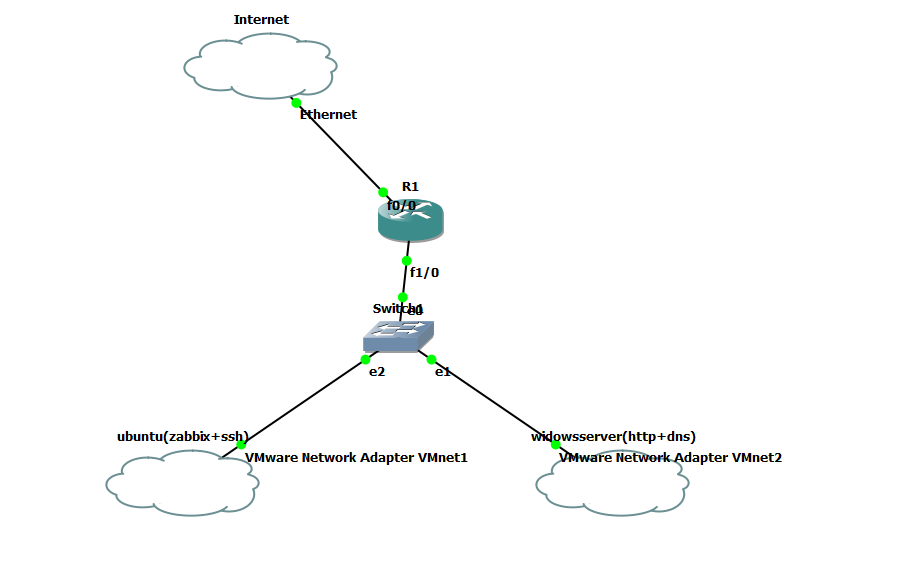

# RAPPORT D'INGÉNIERIE : ARCHITECTURE DE SUPERVISION PROACTIVE ET GESTION DES SLA

**Auteur :** HMAMI Mohamed HAMDI Maroua 

Administration Système, Ingénierie Réseau et Haute Disponibilité

---

## I. INTRODUCTION : L'ENJEU DE LA HAUTE DISPONIBILITÉ

Dans le contexte numérique actuel, la garantie de disponibilité des services est au cœur des préoccupations des directions informatiques. L'objectif de ce projet d'ingénierie est de concevoir, déployer et éprouver une architecture réseau virtualisée complète, dotée d'une plateforme de supervision de pointe.

L'enjeu n'est pas seulement de détecter les pannes techniques, mais de les traduire en indicateurs métiers via un **SLA (Service Level Agreement)**, permettant ainsi d'auditer la qualité du service rendu aux utilisateurs.

---

## II. TOPOLOGIE ET ARCHITECTURE RÉSEAU (GNS3)

La fondation de notre projet repose sur un environnement réseau émulé sous GNS3, assurant une ségrégation logique stricte entre les services.

> 
> 
> 
> 
> 
> *Figure 1 : Maillage réseau de l'infrastructure sous GNS3.*
> 

**Analyse de l'architecture :**

- **Cœur de Réseau :** Un routeur Cisco (R1) opère le routage inter-VLAN et assure la passerelle vers l'extérieur (Cloud Internet).
- **Segment Administration (VMnet1) :** Héberge notre serveur Ubuntu centralisant l'outil Zabbix et le service SSH pour l'accès distant sécurisé.
- **Segment Applicatif (VMnet2) :** Héberge le serveur d'infrastructure Windows Server.
- Un commutateur central (Switch0) distribue la connectivité physique (interfaces e1, e2) vers nos adaptateurs de réseau virtuel (VMware Network Adapters).

---

## III. DÉPLOIEMENT DES SERVICES ET VALIDATION DU ROUTAGE

Avant d'implémenter la supervision, nous avons déployé les rôles serveurs et validé les tables de routage de notre routeur Cisco.

### 3.1. Provisioning du Serveur Applicatif

Le serveur Windows a été configuré pour héberger les services critiques de l'entreprise.

**Analyse :** La capture confirme la bonne installation et l'exécution sans erreur (indicateurs au vert) des rôles **DNS** (résolution de noms) et **IIS** (serveur Web HTTP).

### 3.2. Validation de la Connectivité Bidirectionnelle

Le monitoring exige un réseau sous-jacent irréprochable. Nous avons procédé à des tests ICMP croisés entre les différents sous-réseaux.

> 
> 
> 
> 
> 

> 
> 
> 
> 
> 

**Analyse :** Les requêtes ICMP (Ping) aboutissent avec des temps de réponse optimaux (< 2ms en moyenne). L'utilitaire `ipconfig` valide l'attribution correcte de l'IP `192.168.1.20` avec la passerelle `192.168.1.1` gérée par R1. Le routage inter-VLAN est pleinement opérationnel.

---

## IV. INTÉGRATION DE LA SUPERVISION (ZABBIX)

Le socle réseau validé, nous avons intégré notre hyperviseur de supervision.

### 4.1. Recensement et Cartographie des Hôtes

Pour une remontée de métriques précise, des **Agents Zabbix** natifs ont été déployés sur les systèmes d'exploitation.

> 
> 
> 
> 
> 

**Analyse :** Le système surveille trois entités majeures. La présence des étiquettes vertes **"ZBX"** en face de `Windows-Server` et `Zabbix server` atteste que les agents communiquent activement en TCP (port 10050). Le `Routeur-GNS3` est quant à lui supervisé via des sondes ICMP directes. Des "Tags" de classification (`class: os`, `target: windows`) ont été appliqués pour l'organisation de la base de données.

### 4.2. Validation de l'État Nominal

Avant de configurer le SLA, nous avons généré un rapport de disponibilité technique.

> 
> 
> 
> 
> 

**Analyse :** Sur la période d'observation (les 5 dernières minutes), l'ensemble des déclencheurs (Triggers) affichent un score de **100.0000% OK**. Le routeur répond au ping, et les services internes Windows (DNS, DHCP, IIS) sont stables. Aucune anomalie n'est détectée.

---

## V. GESTION DE LA QUALITÉ : LE CONTRAT SLA

La valeur ajoutée de ce projet réside dans la mise en œuvre d'un tableau de bord de conformité (SLA).

> 
> 
> 
> 
> 

**Analyse :** Nous avons créé un "Rapport Disponibilité Hebdomadaire". L'objectif de service strict (SLO - Service Level Objective) a été fixé à **99.9%**, un standard de l'industrie pour les infrastructures critiques, impliquant une tolérance de panne quasi nulle sur une période 24x7.

---

## VI. ÉPREUVE DE RUPTURE : LE STRESS TEST ET IMPACT SLA

Pour valider l'intelligence du système, nous avons simulé un sinistre multi-nœuds (coupure réseau et arrêt manuel des services).

*Figure 8 : Dashboard SLA en cours d'incident majeur.*

**Analyse détaillée du tableau de bord de crise :**

Le système sanctionne mathématiquement l'indisponibilité. Zabbix applique l'équation de disponibilité au prorata du temps :

$$SLA = \left( \frac{\text{Temps total de la période} - \text{Temps de panne}}{\text{Temps total de la période}} \right) \times 100$$

- **Disponibilité Routeur GNS3 (26.5%) :** L'arrêt du nœud central a immédiatement été répercuté. Son temps de vie en état "Problem" a détruit le score SLA.
- **Disponibilité Serveur Web IIS (85.4%) et DNS (96.4%) :** Les scores chutent car les sondes Zabbix ne parviennent plus à joindre les ports TCP 80 et UDP/TCP 53.
- **Disponibilité Service SSH (99.9%) :** Démonstration de la fiabilité de l'outil : le service SSH (hébergé sur le même réseau logique que Zabbix) conserve son score maximal, prouvant que Zabbix identifie précisément l'étendue de la panne sans déclencher de "faux positifs" sur le reste du datacenter.

---

## VII. CONCLUSION GÉNÉRALE

Ce projet d'ingénierie a permis de déployer un écosystème informatique résilient de bout en bout.

Nous avons démontré notre capacité à :

1. Concevoir et router une architecture multi-VLAN sécurisée sous GNS3.
2. Déployer des services applicatifs critiques (Web, DNS, SSH) sur des environnements hétérogènes (Windows / Linux).
3. Implémenter une supervision granulaire via des agents actifs.
4. Traduire des métriques techniques brutes en **indicateurs de performance décisionnels (SLA)**.

L'infrastructure est désormais prête pour la production : auditable, transparente et proactive dans la détection des incidents.